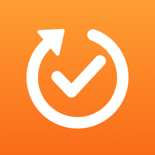

## 안녕하세요, 사람들이 실제로 쓰는 앱을 만드는 iOS 개발자입니다

> I build and ship iOS apps that people actually use — from the first idea to real users.

아이디어를 정하는 데서 끝나지 않고, 실제로 쓰이게 만들고, 쓰는 사람의 이야기를 듣고 고치는 과정까지가 개발이라고 생각합니다. 모든 판단과 과정을 기록하며 일합니다.

### 프로젝트

| | 프로젝트 | 소개 |
|---|---|---|
|  | **[Check Again](https://github.com/skyun-ui/check-again)** | 마지막으로 한 때부터 다시 세서 알려 주는 할 일 앱 (iOS · 출시 준비 중) |

### 주로 쓰는 기술

- **iOS**: Swift, SwiftUI, SwiftData, WidgetKit, App Intents, UserNotifications, EventKit
- **품질**: Swift Testing 단위 테스트, 실기기 측정 기반 성능 개선
- **일하는 방식**: 문서로 먼저 설계하고, 결정의 이유를 남기고, AI 도구(Claude Code)를 판단이 아닌 실행을 빠르게 하는 데 씁니다
